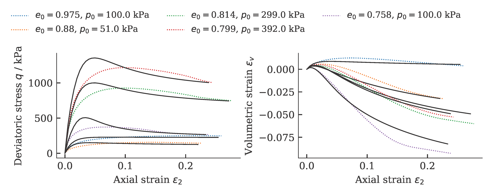
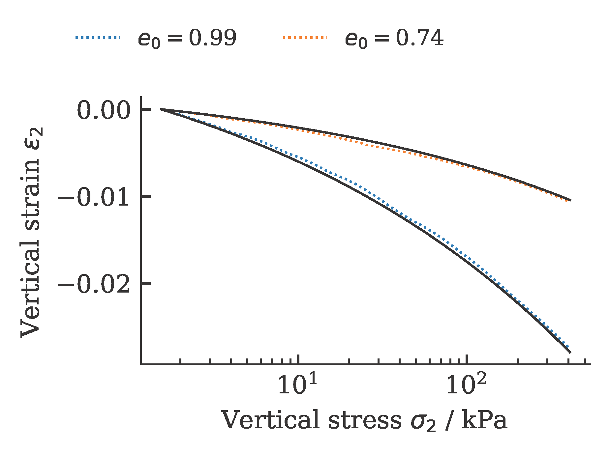
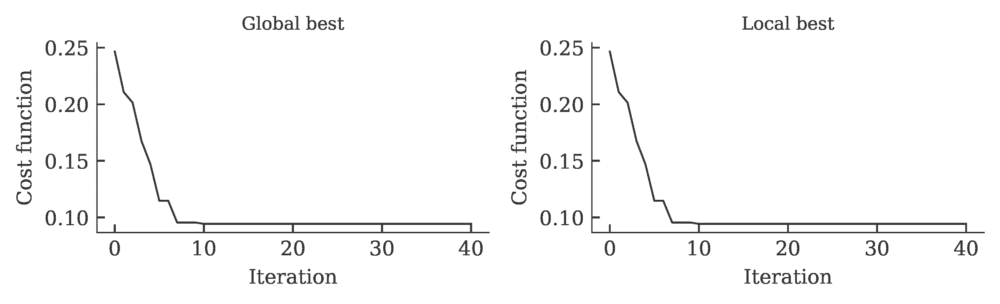
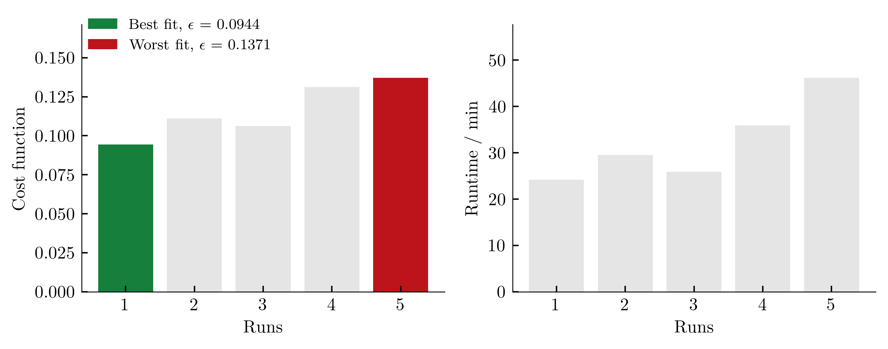
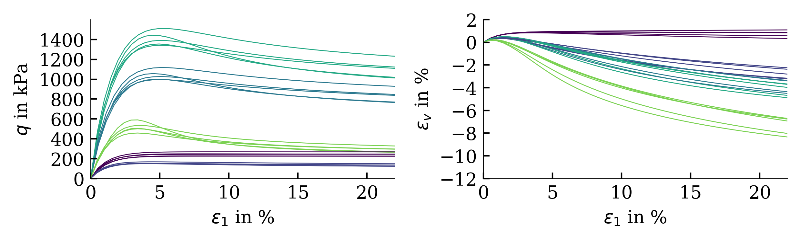

    ---
    layout: default
    title: Cross-Entropy Method
    parent: Optimization algorithms
    nav_order: 2
    ---
## Cross-Entropy Method

The Cross-Entropy Method (CEM) is a probabilistic optimization belonging to the field of Stochastic Optimization. It was developed as an efficient estimation technique for rare-event probabilities in discrete event simulation systems by Rubinstein in 1997 [1] and was adapted for use in optimization. Detailed introduction in CEM is given in [2].

The information processing strategy of the algorithm is to sample the problem space and approximate the distribution of good solutions. This is achieved by assuming a distribution of the problem space (such as Gaussian), sampling the problem domain by generating candidate solutions using the distribution, and updating the distribution based on the better candidate solutions discovered. Samples are constructed stepwise (one component at a time) based on the summarized distribution of good solutions. As the algorithm progresses, the distribution becomes more refined until it focuses on the area or scope of optimal solutions in the domain.

Exemplarily, the results of a calibration of a hypoplastic model ($\phi_c$, $h_s$, $n$, $e_{c0}$, $e_{d0}$, $e_{i0}$, $\alpha$, $\beta$) for Karlsruhe Fine Sand (BMU-Sand) are shown by means of drained monotonic triaxial tests:



and oedometric compression tests:



The development of the global and local cost function is shown in the figure below. It can be seen that the value of the cost function stagnates over 15 iterations. This was defined as a termination criterion for the optimization.



To get an (incomplete) impression about the reproducibility of the results, we repeat the calibration five times. The achieved values of the cost function as well as the required computing time per run (2x AMD Ryzen Threadripper PRO 3955WX 16-Cores, 3900 MHz, WSL2) are shown below.



The influence of the scatter in the costfunction on the simulation outcome is shown below (from large variations in cost functions, large variations in simulation results are expected):



### Example
```python
import numpy as np
import sys,os
  
import ACT.globals as ACTglobals
import ACT.mealpy as ACTmealpy
import ACT.excel as ACTexcel
import ACT.weights as ACTweights

# Load python library for the calibration
from ACT.hypoplasticity import hypoplasticity
from ACT.sanisand import sanisand

# Read in data
excelfile = './Database_BMU_Sand.xlsx'
exp_oedometer, exp_triaxCD, exp_triax_CUcyc = ACTexcel.collect(excelfile)

 # empty the cyclic triaxial tests, we only want to calibrate the "monotonic" parameters
exp_triax_CUcyc = []

# smoothen the data...
for oedo in exp_oedometer:
    oedo.interpolate(N=50)

for triax in exp_triaxCD:
    triax.interpolate(N=50)

# Start optimization
hypo = hypoplasticity()
hypo.set(ec=1.054, ed=0.677, ei=1.15, phic=33.1/180*np.pi, alpha=0.14, beta=2.5, R=1e-4, mT=1., mR=1.)

to_optimize = ['hs','n']

ACTglobals.setup(
  Model = hypo,
  Free_parameter = to_optimize,
  oedometer = exp_oedometer,
  triaxCD = exp_triaxCD,
  triaxCUcyc = exp_triax_CUcyc,
  Similarity = 'frechet',
  path = os.getcwd())

ACTmealpy.optimize(maxiter=100, n_cpu=4, method='Cross-Entropy')
```

### References
[1] R. Y. Rubinstein. Optimization of computer simulation models with rare events. European Journal of Operations Research, 99:89–112, 1997. [[[https://doi.org/10.1016/S0377-2217(96)00385-2](https://doi.org/10.1016/S0377-2217%2896%2900385-2 "Persistent link using digital object identifier")]]

[2] P. T. De Boer, D. P. Kroese, S. Mannor, and R. Y. Rubinstein. A tutorial on the cross-entropy method. Annals of Operations Research, 134(1):19–67, 2005. [[https://doi.org/10.1007/s10479-005-5724-z]]
