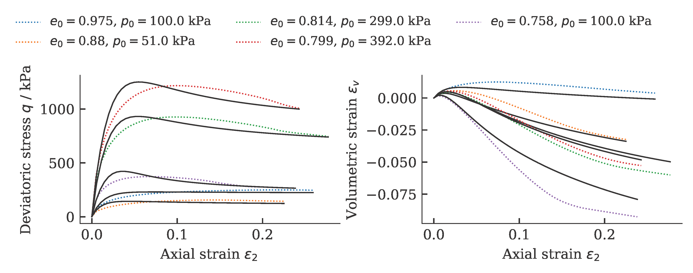
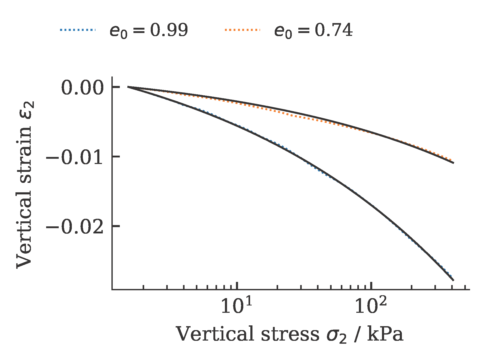
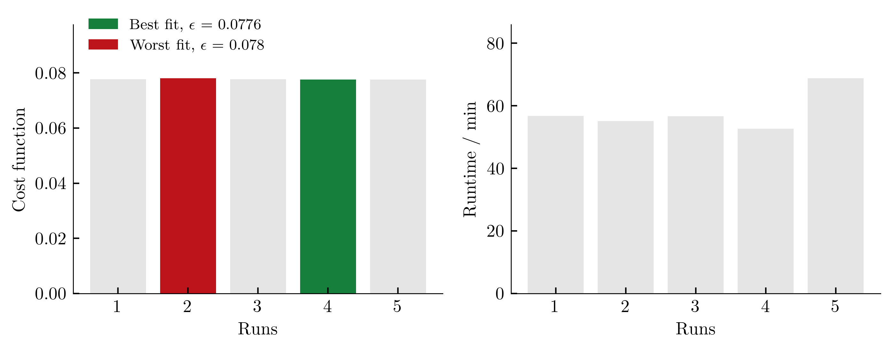
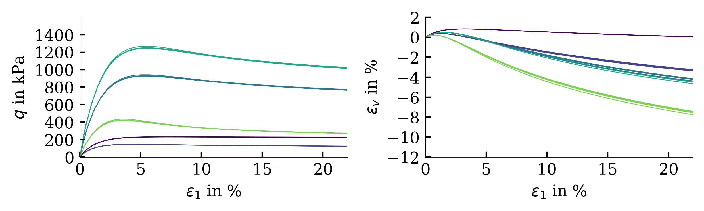

    ---
    layout: default
    title: Differential Evolution - scipy (classical)
    parent: Optimization algorithms
    nav_order: 2
    ---
## Differential Evolution - scipy (classical)

Differential evolution (DE), proposed by Storn and Price [1], is a population-based metaheuristic search algorithm that optimizes a problem by iteratively improving a candidate solution based on an evolutionary process.

Exemplarily, the results of a calibration of a hypoplastic model ($\phi_c$, $h_s$, $n$, $e_{c0}$, $e_{d0}$, $e_{i0}$, $\alpha$, $\beta$) for Karlsruhe Fine Sand (BMU-Sand) are shown by means of drained monotonic triaxial tests:



and oedometric compression tests:



To get an (incomplete) impression about the reproducibility of the results, we repeat the calibration five times. The achieved values of the cost function as well as the required computing time per run (2x AMD Ryzen Threadripper PRO 3955WX 16-Cores, 3900 MHz, WSL2) are shown below.



The influence of the scatter in the costfunction on the simulation outcome is shown below (from large variations in cost functions, large variations in simulation results are expected):



### Usage
To use scipy's implementation of a Differential Evolution algorithm, import the corresponding functionality from the ACT:

```python
import ACT.scipy as ACTscipy
```
To start the optimization, call the `optimize` function:

```python
ACTscipy.optimize(maxiter=500, n_cpu=32, popsize=20, method='DifferentialEvolution')
```
Arguments of the function are:
* `maxiter`: maximum number of iterations performed during optimization. After `maxiter` iterations, the optimization is terminated regardless of whether the required accuracy has been achieved or not. The default value is `maxiter=200` .
* `n_cpu`: number of threads to be used during optimization. The default value is `n_cpu=1`.
* `popsize`: multiplier for setting the total population size. The population size is calculated as the next power of 2 after `popsize * N`. The default value is `popsize=15` . 
* `method='DifferentialEvolution'`. Do not change.

A complete example is given in the subsequent section

### Example
```python
import numpy as np
import sys,os

import ACT.globals as ACTglobals
import ACT.scipy as ACTscipy
import ACT.excel as ACTexcel
import ACT.weights as ACTweights

# Load python library for the calibration
from ACT.hypoplasticity import hypoplasticity
from ACT.sanisand import sanisand

# ===============================================
# Read in data
# ===============================================

# BMU Sand (aka 'Karlsruhe Finesand')
excelfile = './Database_BMU_Sand.xlsx'

# Read in the date
exp_oedometer, exp_triaxCD, exp_triax_CUcyc = ACTexcel.collect(excelfile)

exp_triax_CUcyc = []

# smoothen the data...
for oedo in exp_oedometer:
    oedo.interpolate(N=50)

for triax in exp_triaxCD:
    triax.interpolate(N=50)

# weighting factors for error calculation
weights={}

# triaxCD:
# w_q: q vs. vertical strain eps1  
# w_epsv: volumetric strain vs. eps1
weights["triaxCD"]={"w_q": 2./3.,"w_epsV": 1./3.}

# ===============================================
# Start optimization
# ===============================================

hypo = hypoplasticity()

hypo.set(ec=1.054, ed=0.677, ei=1.15, phic=33.1/180*np.pi, alpha=0.14, beta=2.5, R=1e-4, mT=1., mR=1.)

to_optimize = ['phic','hs','n','ec','ed','ei','alpha','beta']

ACTglobals.setup(
  Model = hypo,
  Free_parameter = to_optimize,
  oedometer = exp_oedometer,
  triaxCD = exp_triaxCD,
  triaxCUcyc = exp_triax_CUcyc,
  Similarity = 'frechet',
  Weights = weights,
  path = os.getcwd())

ACTscipy.optimize(maxiter=500, n_cpu=32, popsize=20, method='DifferentialEvolution')
```

### References
[1] Storn R, Price K (1997) Differential evolution - a simple and efficient heuristic for global optimization over continuous spaces. J Global Optim 11(4):341–359. [[https://doi.org/10.1023/A: 1008202821328]]