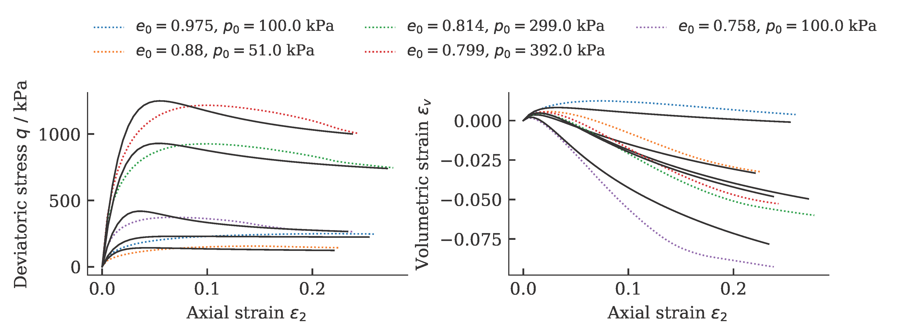
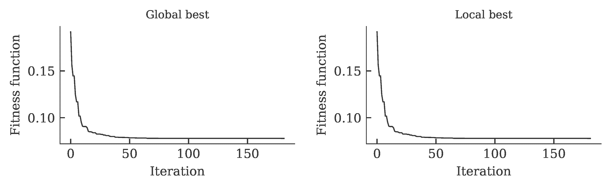
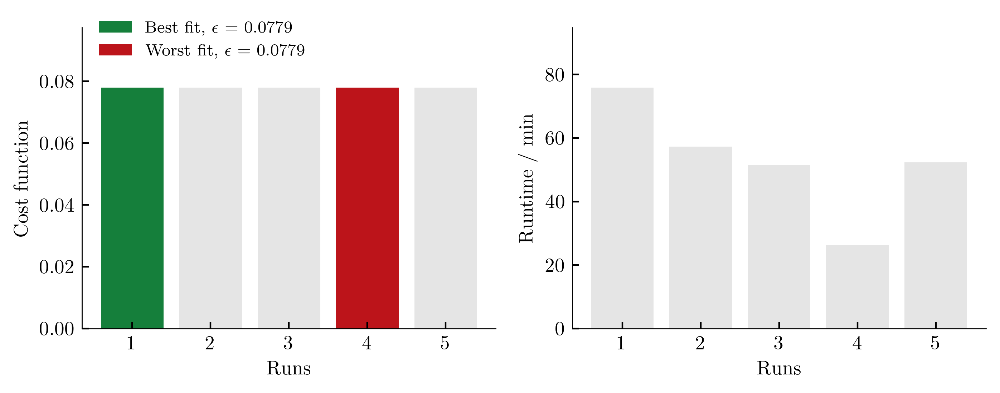
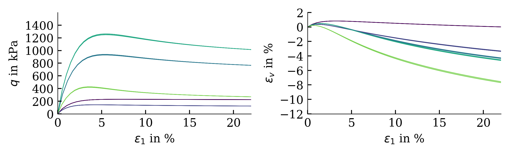
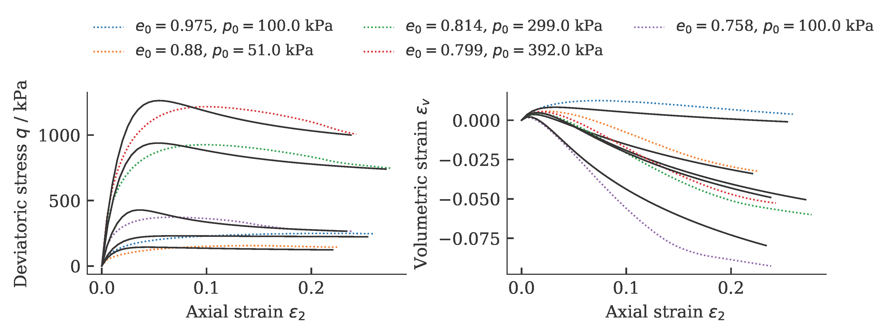
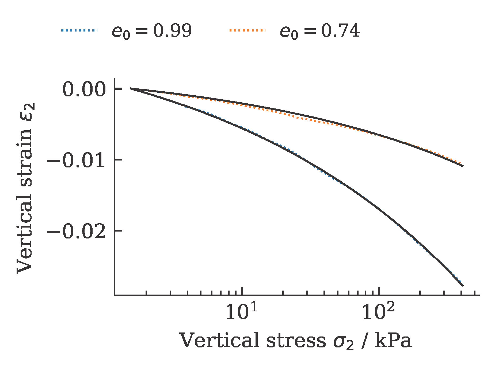
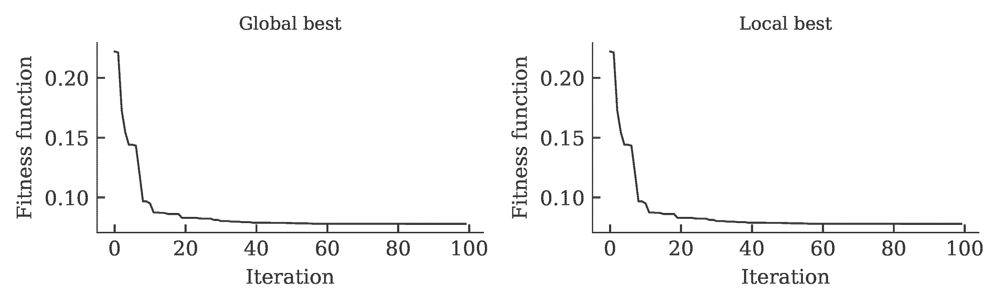
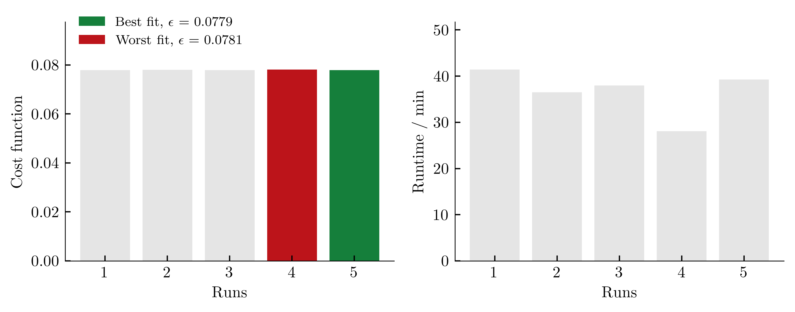
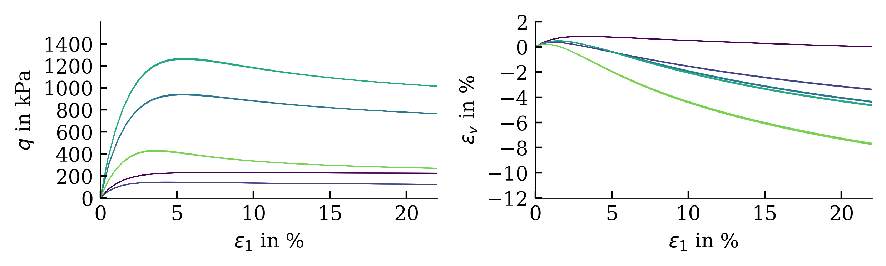

    ---
    layout: default
    title: Differential Evolution (classical)
    parent: Optimization algorithms
    nav_order: 2
    ---
## Differential Evolution (classical)

Differential evolution (DE), proposed by Storn and Price [1], is a population-based metaheuristic search algorithm that optimizes a problem by iteratively improving a candidate solution based on an evolutionary process.

Exemplarily, the results of a calibration of a hypoplastic model ($\phi_c$, $h_s$, $n$, $e_{c0}$, $e_{d0}$, $e_{i0}$, $\alpha$, $\beta$) for Karlsruhe Fine Sand (BMU-Sand) are shown by means of drained monotonic triaxial tests:



and oedometric compression tests:


The development of the global and local cost function is shown in the figure below. It can be seen that the value of the cost function stagnates over 15 iterations. This was defined as a termination criterion for the optimization.



To get an (incomplete) impression about the reproducibility of the results, we repeat the calibration five times. The achieved values of the cost function as well as the required computing time per run (2x AMD Ryzen Threadripper PRO 3955WX 16-Cores, 3900 MHz, WSL2) are shown below.



The influence of the scatter in the costfunction on the simulation outcome is shown below (from large variations in cost functions, large variations in simulation results are expected):



As we can see from the course of the cost function, the DE very quickly finds very good solutions (low values of the cost function) and improves very little from then on. In the previous calibrations, the optimization was stopped when the cost function did not improve further in 15 consecutive iterations. The above plot encourages to reduce this value and thus reduce the required computation time for the calibration. The results for five calibrations with a termination criterion of 10 (instead of 15) is shown below. Starting with the drained monotonic triaxial tests



and oedometric compression tests:



The development of the global and local cost function is shown in the figure below. It can be seen that the value of the cost function stagnates over 15 iterations. This was defined as a termination criterion for the optimization.



To get an (incomplete) impression about the reproducibility of the results, we repeat the calibration five times. The achieved values of the cost function as well as the required computing time per run (2x AMD Ryzen Threadripper PRO 3955WX 16-Cores, 3900 MHz, WSL2) are shown below.



The influence of the scatter in the costfunction on the simulation outcome is shown below (from large variations in cost functions, large variations in simulation results are expected):




### Example
```python
import numpy as np
import sys,os
  
import ACT.globals as ACTglobals
import ACT.mealpy as ACTmealpy
import ACT.excel as ACTexcel
import ACT.weights as ACTweights

# Load python library for the calibration
from ACT.hypoplasticity import hypoplasticity
from ACT.sanisand import sanisand

# Read in data
excelfile = './Database_BMU_Sand.xlsx'
exp_oedometer, exp_triaxCD, exp_triax_CUcyc = ACTexcel.collect(excelfile)

 # empty the cyclic triaxial tests, we only want to calibrate the "monotonic" parameters
exp_triax_CUcyc = []

# smoothen the data...
for oedo in exp_oedometer:
    oedo.interpolate(N=50)

for triax in exp_triaxCD:
    triax.interpolate(N=50)

# Start optimization
hypo = hypoplasticity()
hypo.set(ec=1.054, ed=0.677, ei=1.15, phic=33.1/180*np.pi, alpha=0.14, beta=2.5, R=1e-4, mT=1., mR=1.)

to_optimize = ['hs','n']

ACTglobals.setup(
  Model = hypo,
  Free_parameter = to_optimize,
  oedometer = exp_oedometer,
  triaxCD = exp_triaxCD,
  triaxCUcyc = exp_triax_CUcyc,
  Similarity = 'frechet',
  path = os.getcwd())

ACTmealpy.optimize(maxiter=100, n_cpu=4, method='DifferentialEvolution')
```

### References
[1] Storn R, Price K (1997) Differential evolution - a simple and efficient heuristic for global optimization over continuous spaces. J Global Optim 11(4):341–359. [[https://doi.org/10.1023/A: 1008202821328]]