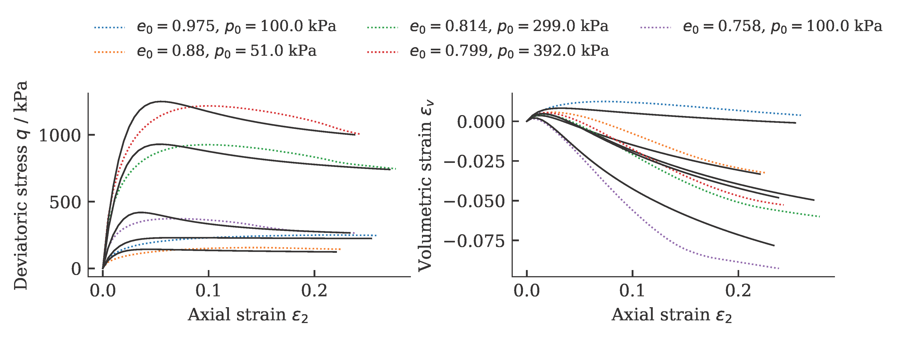
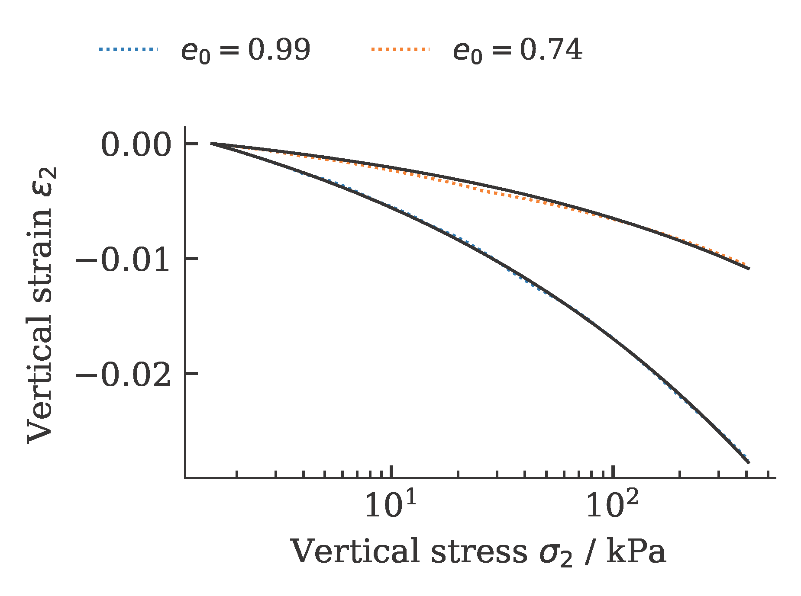
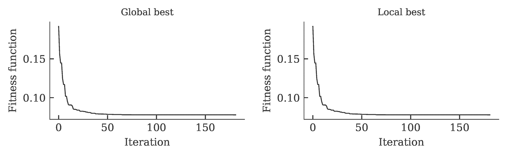
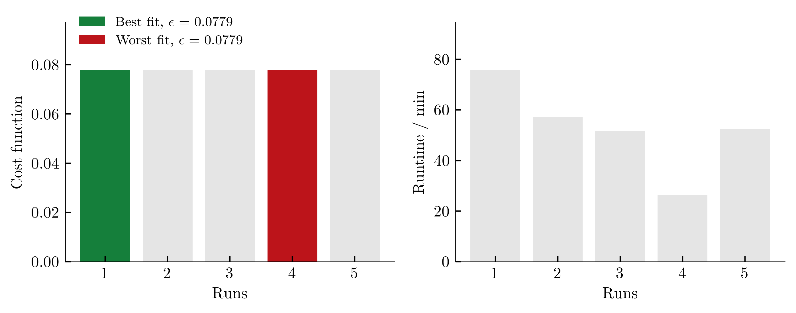
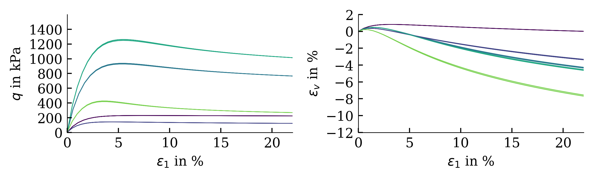

## Differential Evolution (classical)

Differential Evolution (DE), proposed by Storn and Price [1], is a population-based metaheuristic search algorithm that optimizes a problem by iteratively improving a candidate solution based on an evolutionary process.

### Usage
The Differential Evolution optimization algorithm is accessible via the mealpy library using the following command:
```python
ACTmealpy.optimize(maxiter=100, n_cpu=32, method='DifferentialEvolution')
```

### Example
Exemplarily, the results of a calibration of a hypoplastic model ($\phi_c$, $h_s$, $n$, $e_{c0}$, $e_{d0}$, $e_{i0}$, $\alpha$, $\beta$) for Karlsruhe Fine Sand (BMU-Sand) are shown by means of drained monotonic triaxial tests:



and oedometric compression tests:



The development of the global and local cost function is shown in the figure below. It can be seen that the value of the cost function stagnates over 15 iterations. This was defined as a termination criterion for the optimization.



To get an (incomplete) impression about the reproducibility of the results, we repeat the calibration five times. The achieved values of the cost function as well as the required computing time per run (2x AMD Ryzen Threadripper PRO 3955WX 16-Cores, 3900 MHz, WSL2) are shown below.



The influence of the scatter in the costfunction on the simulation outcome is shown below (from large variations in cost functions, large variations in simulation results are expected):



### References
[1] Storn R, Price K (1997) Differential evolution - a simple and efficient heuristic for global optimization over continuous spaces. J Global Optim 11(4):341–359. [[https://doi.org/10.1023/A: 1008202821328]]