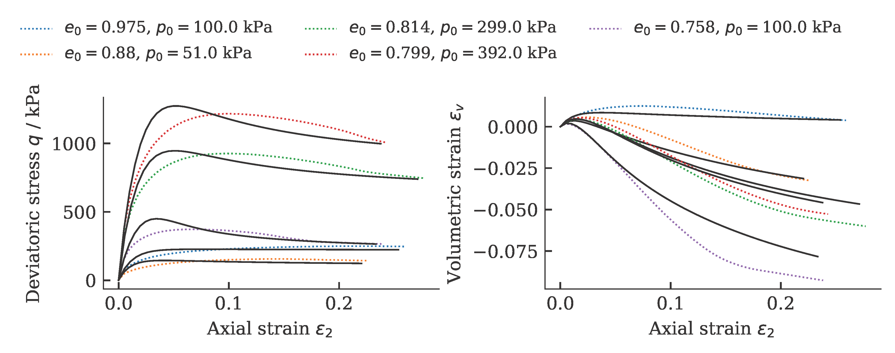
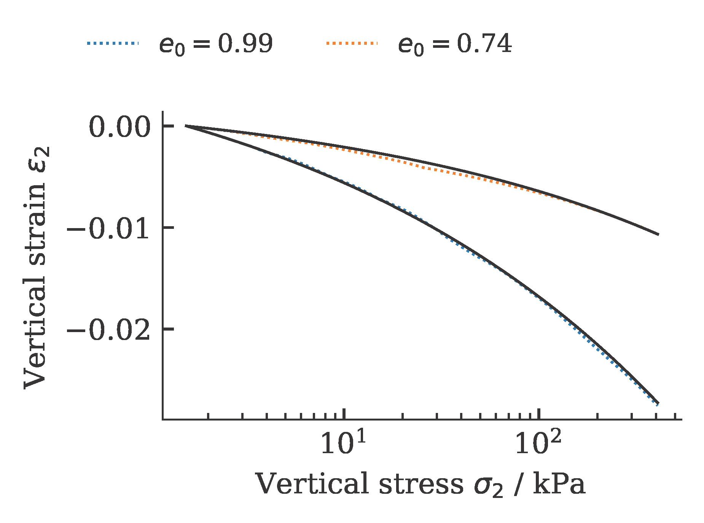
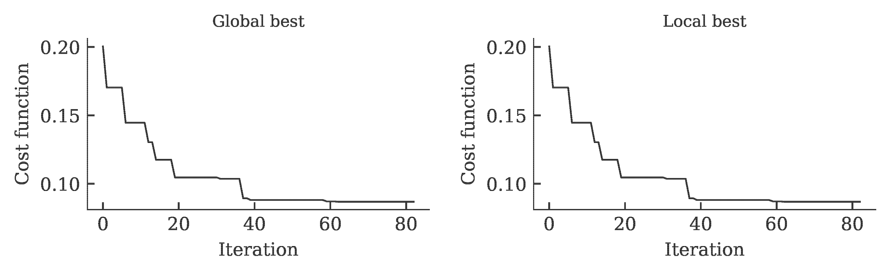
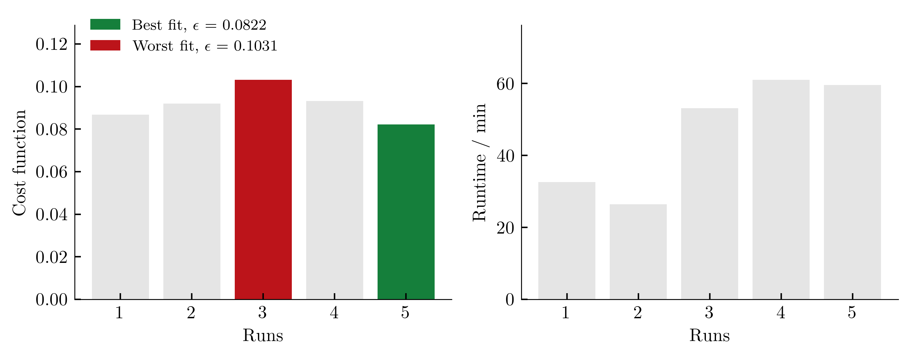

## Comprehensive Learning Particle Swarm Optimization (PSO-CL)


Exemplarily, the results of a calibration of a hypoplastic model ($\phi_c$, $h_s$, $n$, $e_{c0}$, $e_{d0}$, $e_{i0}$, $\alpha$, $\beta$) for Karlsruhe Fine Sand (BMU-Sand) are shown by means of drained monotonic triaxial tests:



and oedometric compression tests:



The development of the global and local cost function is shown in the figure below. It can be seen that the value of the cost function stagnates over 15 iterations. This was defined as a termination criterion for the optimization.



To get an (incomplete) impression about the reproducibility of the results, we repeat the calibration five times. The achieved values of the cost function as well as the required computing time per run (2x AMD Ryzen Threadripper PRO 3955WX 16-Cores, 3900 MHz, WSL2) are shown below.



The influence of the scatter in the costfunction on the simulation outcome is shown below (from large variations in cost functions, large variations in simulation results are expected):


### Example
```python
import numpy as np
import sys,os
  
import ACT.globals as ACTglobals
import ACT.mealpy as ACTmealpy
import ACT.excel as ACTexcel
import ACT.weights as ACTweights

# Load python library for the calibration
from ACT.hypoplasticity import hypoplasticity
from ACT.sanisand import sanisand

# Read in data
excelfile = './Database_BMU_Sand.xlsx'
exp_oedometer, exp_triaxCD, exp_triax_CUcyc = ACTexcel.collect(excelfile)

 # empty the cyclic triaxial tests, we only want to calibrate the "monotonic" parameters
exp_triax_CUcyc = []

# smoothen the data...
for oedo in exp_oedometer:
    oedo.interpolate(N=50)

for triax in exp_triaxCD:
    triax.interpolate(N=50)

# Start optimization
hypo = hypoplasticity()
hypo.set(ec=1.054, ed=0.677, ei=1.15, phic=33.1/180*np.pi, alpha=0.14, beta=2.5, R=1e-4, mT=1., mR=1.)

to_optimize = ['hs','n']

ACTglobals.setup(
  Model = hypo,
  Free_parameter = to_optimize,
  oedometer = exp_oedometer,
  triaxCD = exp_triaxCD,
  triaxCUcyc = exp_triax_CUcyc,
  Similarity = 'frechet',
  path = os.getcwd())

ACTmealpy.optimize(maxiter=100, n_cpu=4, method='ParticleSwarmOptimization-CL')
```

### References
[1] 
