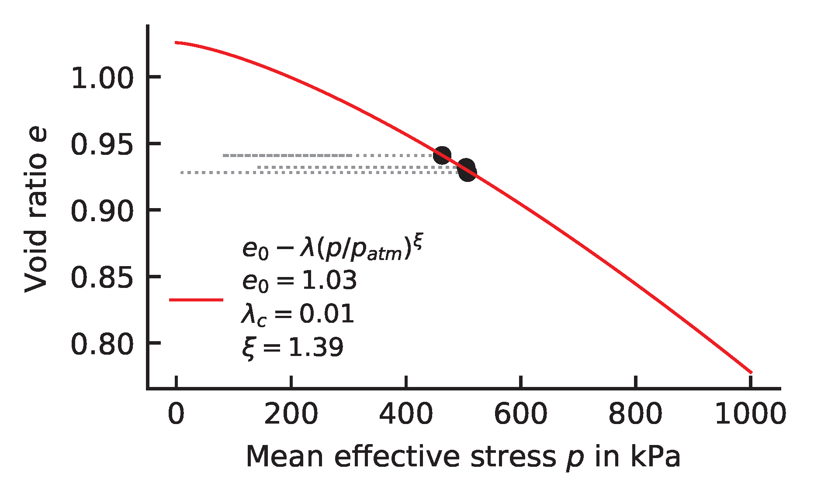

# SANISAND
{: .no_toc }

## Table of contents
{: .no_toc .text-delta }
1. TOC
{:toc}

## Parameters
* $p_{atm}$ - key: `patm` - provided in kPa, in most cases $p_{atm}=100$ kPa is valid.
**Critical state**
* $M_e$ - key: `M_e`
* $M_c$ - key: `M_c` 
* $\lambda_c$ - key: `lambda_c` 
* $e_0$ - key: `e0` 
* $\xi$ - key: `xi` 
**Elasticity**
* $G_0$ - key: `G0`
* $\nu$ - key: `nu`
**Yield surface** 
* $m$ - key: `m`
**Kinematic hardening**
* $n_b$ - key: `n_b`
* $h_0$ - key: `h0`
* $c_h$ - key: `c_h` 
**Plastic volumetric strain** 
* $n_d$ - key: `n_d`
* $A_0$ - key: `A0`
**Fabric-dilatancy tensor**
* $z_{max}$ - key: `z_max`
* $c_z$ - key: `c_z`

  self.e00 = 0.

  self.xi = 0.
  self.M_c0 = 0.
  self.M_e0 = 0.  
  
## Bounds


## Notes

  
## Usage

To access the SANISAND constitutive model for optimization, the `sanisand2` module must first be imported from **numgeo-ACT**:

```python
from ACT.sanisand2 import sanisand2
```
Then (after some more steps to read in the experimental data and choose the constitutive model and the weighting factors) the `sanisand2` class can be initialized:

```python
model = sanisand2()
```

In a next step we initialize some of the parameters of the SANISAND model:

```python
model.set(p_atm = 100, e0 = 1.0, phic = 32, c_z = 2400, z_max = 100)
```
We initialize $p_{atm}=100$ kPa and $\varphi_{c}$ as the angle of repose obtained from laboratory tests, respectively. Since for the sake of this example we are only interested in the calibration of "monotonic" parameters, we as well initialize $c_z$ and $z_{max}$ to - in this case - known values form a complete calibration performed in the past.

> **Note**
By initializing $\varphi_c$ instead of $M_e$ and $M_c$, the slopes of the CSL in triaxial compression and triaxial extension are automatically initialized as $M_c = 6\sin(\varphi_c)/(3-\sin(\varphi_c))$ and $M_e = 6\sin(\varphi_c)/(3+\sin(\varphi_c))$. Of course $M_c$ and $M_e$ could have also been initialized (without obeying above equations for $M_c(\varphi_c)$ and $M_e(\varphi_c)$) instead of $\varphi_c$.

In the last step we specify which parameters we want to vary during optimization. In the present case we want to optimize all parameters of the SANISAND model influencing the models response during monotonic loading. For convenience, the reference pressure $p_{atm}$ is kept constant.

```python
to_optimize = \['e0','lambda_c', 'xi', 'M_c', 'M_e', 'm', 'G0', 'nue', 'h0', 'c_h', 'n_b', 'A0', 'n_d'\]
```
We have now successfully set up the SANISAND constitutive model for optimization by one of the implemented optimization algorithms $\rightarrow$ [Optimization algorithms]()

### Estimation of $e_0$, $\phi_c$ and $\lambda_c$ from undrained monotonic triaxial tests

In addition to a rigorous heuristic determination of the parameters $e_0$, $\phi_c$ and $\lambda_c$, we additionally provide a simple (and fast) determination of these parameters based on results of triaxial compression tests. The results can either be used as a starting (initial) value for the heuristic optimization or kept constant during the optimization.

```python
model.estimate_e0_lambda_xi(triax_CU=excel.triax_CU)
```
where `triax_CU` requires a list of experimental results of undrained triaxial tests stored in the class `triax_CU`. The result of this function call is printed in the file *e_p_lambdac.pdf* in the *results* directory. An example is given in the following:



## Constitutive Equations

SANISAND [1] is an elasto-plastic model of the following form:

$$
\begin{aligned}
	\bm{\mathring{\sigma}}&= \sf E^{ep} (\bm{\sigma},\bm{\alpha},e,\bm{\dot{\varepsilon}} ):\bm{\dot{\varepsilon}} \\\nonumber
	&=\bigg(2G(\textbf{I}-\vec{\boldsymbol{1}}\vec{\boldsymbol{1}}) + K \vec{\boldsymbol{1}}\vec{\boldsymbol{1}} -\langle L\rangle\bm{\dot{\varepsilon}} ^{-1} \big\{2G\big[B\textbf{n}-C(\textbf{n}^2 - \frac{1}{3}\boldsymbol{1})\big] + KD  \boldsymbol{1}\big\}\bigg):\bm{\dot{\varepsilon}} 
\end{aligned}
$$

The objective stress rate is calculated using:

$$
	\dot{\boldsymbol{\sigma}} = \sf E^{ep} :\dot{\boldsymbol{\varepsilon}}
$$

with the elasto-plastic stiffness $\sf E^{ep}$:

$$
\begin{aligned}
	\sf E^{ep} &=2G(\textbf{I}-\vec{\boldsymbol{1}}\vec{\boldsymbol{1}}) + K \vec{\boldsymbol{1}}\vec{\boldsymbol{1}} \nonumber \\
	&-\langle L\rangle\dot{\boldsymbol{\varepsilon}}^{-1} \big(2G\big[B\textbf{n}-C(\textbf{n}^2 - \frac{1}{3}\boldsymbol{1})\big] + KD  \boldsymbol{1}\big)
\end{aligned}
$$

The scalar elastic stiffness parameters $G$ and $K$ are defined as

$$
\begin{aligned}
	G&=G_{0}~p_{atm}\frac{(2.97-e)^2}{1+e}\sqrt{\frac{p}{p_{\text{atm}}}}\\
	K&=\frac{2(1+\nu)}{3(1-2\nu)}G.
\end{aligned}
$$

where $G_{0}$, $p_{atm}$ and $\nu$ are material parameters. The plastic multiplier (or loading index) $L$ is larger than zero if the yield surface representing a wedge in the 2D stress space and defined by
$$
	f=\sqrt{(\boldsymbol{\sigma}^{*}-p\boldsymbol{\alpha}):(\boldsymbol{\sigma}^{*}-p\boldsymbol{\alpha})}-\sqrt{\frac{2}{3}}pm <0
$$

is no longer satisfied. The back-stress tensor $\boldsymbol{\alpha}$ defines the centre of the wedge and $m$ is the opening of the wedge. For stress states inside of the wedge, a hypoelastic material response is assumed. 

$$
	\textbf{n} = \frac{\boldsymbol{\sigma}^{*}/p - \boldsymbol{\alpha}}{\sqrt{2/3}pm}
$$

The plastic multiplicator $L$ is given by
$$
	L=\frac{2G \textbf{n}:\dot{\boldsymbol{\varepsilon}}^* - K \textbf{n}:\textbf{r}~ \text{tr}(\dot{\boldsymbol{\varepsilon}})}
	{ K_p 2G (B -C \text{tr}~\textbf{n}^3) -  KD  \textbf{n}:\textbf{r}}.
$$

Using $\dot{\boldsymbol{\varepsilon}}^* = (\textbf{I}-\vec{\boldsymbol{1}}\vec{\boldsymbol{1}}):\dot{\boldsymbol{\varepsilon}}$ and $\text{tr}(\dot{\boldsymbol{\varepsilon}}) = \boldsymbol{1}:\dot{\boldsymbol{\varepsilon}}$, above equation is rewritten to

$$
	L=\frac{\big(2G \textbf{n}:(\textbf{I}-\vec{\boldsymbol{1}}\vec{\boldsymbol{1}}) -  \textbf{n}:\textbf{r}~\boldsymbol{1}\big):\dot{\boldsymbol{\varepsilon}}}
	{ K_p 2G (B -C \text{tr}~\textbf{n}^3) -  KD  \textbf{n}:\textbf{r}}.
$$

$K_p$ is a hardening variable and defined as

$$
	K_p=\frac{2}{3}ph(\boldsymbol{\alpha}^b_{\theta} - \boldsymbol{\alpha}):\textbf{n}
$$

where $h$ is given by

$$
	h=\frac{G_{0}h_{0}(1-c_{h}e)\left(\frac{p}{p_{\text{atm}}}\right)^{-1/2}}{(\boldsymbol{\alpha}-\boldsymbol{\alpha}_{\textrm{ini}}):\textbf{n}}
$$

and $\boldsymbol{\alpha}^b_{\theta}$ by

$$
	\boldsymbol{\alpha}^b_{\theta}=\sqrt{\frac{2}{3}}\bigg[g(\theta,c)Me^{-n^b\psi}-m\bigg]\textbf{n}.
$$

$M$ is the stress ratio in the critical state, $n^b$ and $m$ are parameters introduced later. $\psi$ is the Been & Jefferies [2] state variable and defined as

$$
	\psi = e - e_c= e-e_{0}+\lambda_{c}~(p_c/p_{\text{atm}})^{\xi},
$$

with the Lode angle function $g(\theta,c)$:

$$
	g(\theta,c) = \frac{2c}{(1+c)-(1-c)\cos(3\theta)} ~~~;~~~ \text{where}: ~\cos (3\theta) = \sqrt{6}\text{tr}(\textbf{n}^3).
$$

The dilatancy $D$ is defined by:

$$
	D = A_d(\boldsymbol{\alpha}^d_{\theta} - \boldsymbol{\alpha}):\textbf{n}
$$

where $\alpha^d_{\theta}$ is

$$
	\boldsymbol{\alpha}^d_{\theta}=\sqrt{\frac{2}{3}}\bigg[g(\theta,c)Me^{n^d\psi}-m\bigg]\textbf{n}
$$

and $A_d$

$$
	A_{d}=A_{0}(1+\langle \textbf{z}:\textbf{n}\rangle).
$$

The change of the fabric-dilatancy tensor $\textbf{z}$ is

$$
	\dot{\textbf{z}}= -c_z\langle -d\varepsilon_{v}^{p}\rangle (z_{\text{max}}\textbf{n}+\textbf{z}).
$$

Lastly, the change of the back-stress tensor $\boldsymbol{\alpha}$ is

$$
	\dot{\boldsymbol{\alpha}}= \frac{2}{3}\langle L\rangle h (\boldsymbol{\alpha}^b_{\theta} - \boldsymbol{\alpha})
$$

The initial back-stress tensor $\boldsymbol{\alpha}_{\textrm{ini}}$ is updated to $\boldsymbol{\alpha}$ in case of a load reversal which occurs in case of $(\boldsymbol{\alpha}-\boldsymbol{\alpha}_{\text{ini}}):\textbf{n}<0$


## References

[1] Y. F. Dafalias and M. T. Manzari, ‘Simple plasticity sand model accounting for fabric change effects’, Journal of Engineering mechanics, vol. 130, no. 6, pp. 622–634, 2004.

[2] K. Been and M. G. Jefferies, ‘A state parameter for sands’, _Géotechnique_, vol. 35, no. 2, pp. 99–112, Jun. 1985, doi: [10.1680/geot.1985.35.2.99](https://doi.org/10.1680/geot.1985.35.2.99).