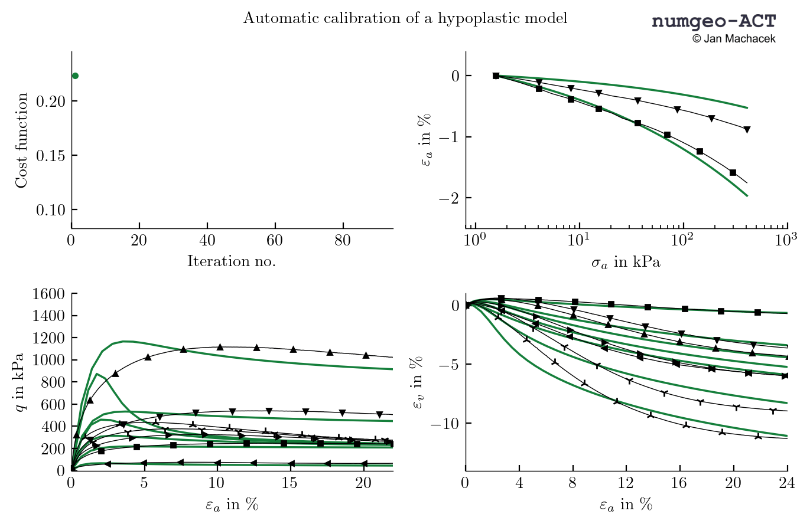

Copyright (C) 2021-2022 Jan Machaček, <jan-machacek@outlook.com>, <jan.machacek@tu-darmstadt.de> 

# Automatic Calibration of advanced constitutive soil models

The numgeo Automatic Calibration Tool(set) (**numgeo-ACT**) aims to simplify and speed up the calibration process and, in particular, to reduce entry hurdles associated with the application of advanced constitutive models such as Hypoplasticity or Sanisand. In addition to simplified calibration, **numgeo-ACT** allows for the investigation of parameter dependencies and reproducibility studies by determining large numbers (several hundreds) of equivalent parameter sets of equal quality for the same material. **numgeo-ACT** is based on heuristic optimization methods and offers access to different similarity measures to quantify the differences between experimental data and simulation results. A graphical example of such a calibration is shown below.

## Availability
numgeo-ACT is currently not yet freely available, but is planned for the medium term. In the meantime, we are happy to perform the calibration for you using the ACT – free of charge, of course. If you are interested, please contact Jan Machaček (<jan-machacek@outlook.com>, <jan.machacek@tu-darmstadt.de>).
